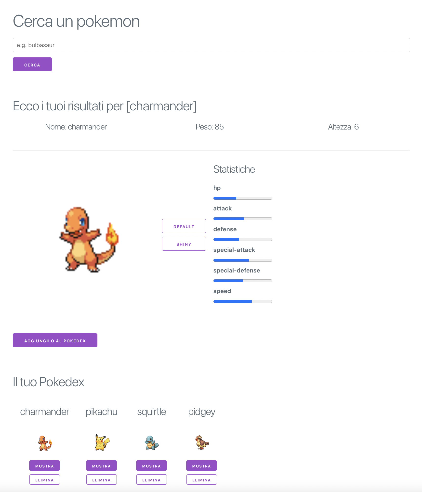

# Frontenders Community
## Challenge #1 - Pokedex (React version)

Lo scopo della challenge è quello di ricreare il layout fornito in allegato.

La web app è suddivisa in tre sezioni:
- Search Bar
Tramite la search bar è possibile cercare un Pokemon. La ricerca va fatta sfruttando l'API PokéAPI (https://pokeapi.co/)

- Dettaglio Pokemon
L'utente visualizza alcune informazioni base del pokemon. Le statistiche sono mostrate in delle progress-bar. L'utente ha anche la possibilità di visualizzare l'immagine del pokemon in modalità default o shiny

- Pokedex
E' possibile aggiungere dei pokemon al proprio pokedex, per un massimo di 10 pokemon. Per ogni pokemon è possibile rivedere le statistiche cliccando su Mostra oppure eliminarlo dal pokedex cliccando su Elimina. Il pokedex viene salvato nel local storage, così che sia disponibile anche dopo il refresh o al riavvio dell'app

### Tecnologie
La web app va sviluppata in plain JS o React. Per lo stile della web app va utilizzata la libreria Milligram CSS (https://milligram.io/#getting-started)

#### Layout

